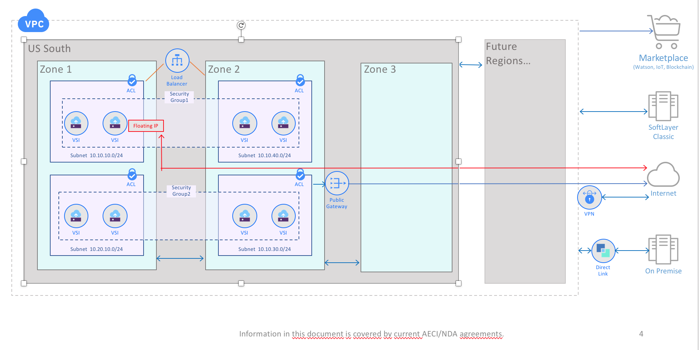

---

copyright:
  years: 2017, 2018
lastupdated: "2018-06-08"

---

{:shortdesc: .shortdesc}
{:new_window: target="_blank"}
{:codeblock: .codeblock}
{:pre: .pre}
{:screen: .screen}
{:tip: .tip}
{:download: .download}

# Planned IBM Virtual Private Cloud Experience
This document describes what we aim to deliver as we move from Beta toward GA in our timeline.

IBM Virtual Private Cloud (IBM Cloud VPC) is a fully-virtualized, software-defined networking experience, with superior isolation in the IBM public cloud. It supports your mission-critical applications and a variety of connectivity options. With IBM Cloud VPC, you can provision your resources and connect them to each other, or isolate them from one another. You can define your networking policies on-premises or with other public clouds. 

## Networking Capabilities

IBM Cloud VPC offers a comprehensive set of networking capabilities, including IP address range selection, virtual firewalls, site-to-site Virtual Private Networks (VPN), and Load Balancing (LBaaS) with elasticity.

You can configure your virtual topology automatically, using our suggested prefix ranges and pre-configured network policies. Later, you can customize your IBM Cloud VPC and adapt it to your changing requirements, seamlessly. In addition, you have the ability both to bring your own private IP and to assign a floating IP.

## Global Connectivity

You can scope your services locally or globally, without bounds, to span across multiple regions. Using VPN, you can create private connections to other projects and other portions of your hybrid cloud deployments.

## Network Security

Security is integrated into your IBM Cloud VPC, with security groups that act as virtual firewalls for instance-level protection, and with access control lists (ACLs) for subnet-level protection. 

## Load Balancing

Within your IBM Cloud VPC, use Load Balancing to distribute your network traffic across a set of targets to improve performance and HA. Load Balancers also monitor the health of your applications and services. You can set up a Load Balancer to distribute incoming application traffic across instances in a single Zone or across multiple Zones.

## Internet Access

Using a Public Gateway (PGW) you can enable your virtual server instances (VSIs) to communicate with the public internet, if you choose. There is no charge for using a PGW, except for the bandwith used.

**Figure: The Planned VPC Experience**

